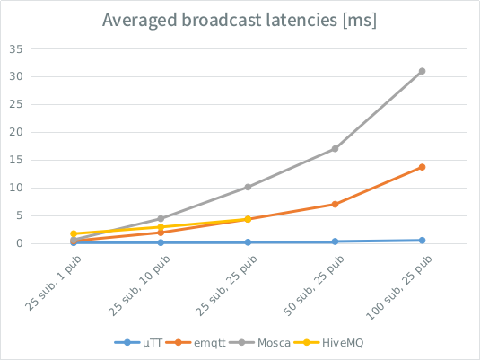

<div align="center"></div>

µTT ("microTT") is a lightweight and efficient MQTT broker designed to raise the bar for pub/sub performance. It significantly outperforms emqtt, Redis, HiveMQ, Mosquitto, RabbitMQ, Mosca and many others. Memory usage per connection is also significantly lower as it builds on the networking foundation developed for µWebSockets.

Read more about MQTT [here](http://mqtt.org/), find client libraries [here](http://www.hivemq.com/mqtt-client-library-encyclopedia).

### Vendor-neutral, minimal & efficient pub/sub
Below is a simple Node.js example using MQTT.js:
```javascript
var mqtt = require('mqtt');

// connect to the broker
var client = mqtt.connect('mqtt://localhost');

client.on('connect', function () {
  // subscribe to all temperature sensors
  client.subscribe('sensors/+/temperature');
  
  // publish some temperature numbers
  client.publish('sensors/house/temperature', '21');
  client.publish('sensors/sauna/temperature', '107');
});

client.on('message', function (topic, message) {
  // receive our numbers
  console.log(topic + ': ' + message.toString() + ' Celcius');
});
```

### Benchmarks
A simple broadcasting benchmark has been developed to determine roughly the publishing performance of a few brokers under varying burst load, as charted below:

<div align="center"></div>

* HiveMQ is proprietary and limited to 25 connections in demo mode.
